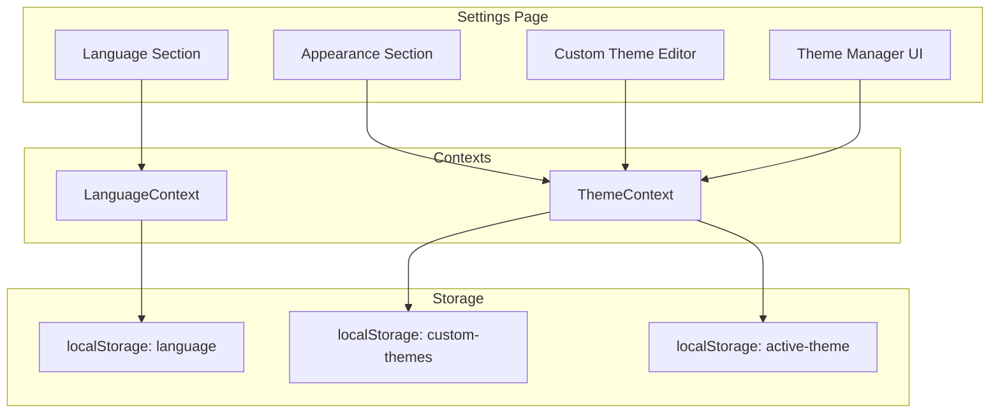

# Design Document: Settings Enhancements

## Overview

This design document outlines the implementation of three major enhancements to the Thoughts+ Settings page:
1. A language selection system with visual flags for internationalization
2. A redesigned, more compact appearance section
3. A custom theme system allowing users to create, save, and manage personalized themes

The implementation will extend the existing ThemeContext and Settings page while maintaining backward compatibility with current theme preferences.

## Architecture



## Components and Interfaces

### 1. Language System

#### LanguageContext
A new React context to manage language state across the application.

```typescript
interface LanguageContextType {
    language: LanguageCode;
    setLanguage: (lang: LanguageCode) => void;
    t: (key: string) => string; // Translation function
}

type LanguageCode = 'en' | 'es' | 'fr' | 'de' | 'pt' | 'ja' | 'zh' | 'ko' | 'it' | 'ru';

interface LanguageOption {
    code: LanguageCode;
    name: string;           // English name
    nativeName: string;     // Name in native script
    flag: string;           // Emoji flag or icon identifier
}
```

#### Supported Languages
```typescript
const SUPPORTED_LANGUAGES: LanguageOption[] = [
    { code: 'en', name: 'English', nativeName: 'English', flag: '🇬🇧' },
    { code: 'es', name: 'Spanish', nativeName: 'Español', flag: '🇪🇸' },
    { code: 'fr', name: 'French', nativeName: 'Français', flag: '🇫🇷' },
    { code: 'de', name: 'German', nativeName: 'Deutsch', flag: '🇩🇪' },
    { code: 'pt', name: 'Portuguese', nativeName: 'Português', flag: '🇧🇷' },
    { code: 'ja', name: 'Japanese', nativeName: '日本語', flag: '🇯🇵' },
    { code: 'zh', name: 'Chinese', nativeName: '中文', flag: '🇨🇳' },
    { code: 'ko', name: 'Korean', nativeName: '한국어', flag: '🇰🇷' },
    { code: 'it', name: 'Italian', nativeName: 'Italiano', flag: '🇮🇹' },
    { code: 'ru', name: 'Russian', nativeName: 'Русский', flag: '🇷🇺' },
];
```

### 2. Custom Theme System

#### Extended ThemeContext Interface
```typescript
interface ThemeContextType {
    // Existing
    theme: 'light' | 'dark' | 'custom';
    accentColor: string;
    setTheme: (theme: 'light' | 'dark' | 'custom') => void;
    setAccentColor: (color: string) => void;
    
    // New for custom themes
    customThemeColors: CustomThemeColors;
    setCustomThemeColors: (colors: Partial<CustomThemeColors>) => void;
    savedThemes: SavedTheme[];
    saveCurrentTheme: (name: string) => void;
    loadTheme: (id: string) => void;
    deleteTheme: (id: string) => void;
    updateTheme: (id: string) => void;
}

interface CustomThemeColors {
    backgroundColor: string;
    textColor: string;
    sidebarBackground: string;
    borderColor: string;
    cardBackground: string;
}

interface SavedTheme {
    id: string;
    name: string;
    accentColor: string;
    colors: CustomThemeColors;
    font: string;
    createdAt: string;
}
```

### 3. UI Components

#### LanguageSelector Component
```typescript
interface LanguageSelectorProps {
    compact?: boolean;  // For use in different contexts
}
```

Renders a grid of language options with:
- Flag emoji/icon
- Native language name
- Visual selection indicator
- Hover states with English name tooltip

#### CustomThemeEditor Component
```typescript
interface CustomThemeEditorProps {
    colors: CustomThemeColors;
    onChange: (colors: Partial<CustomThemeColors>) => void;
}
```

Renders color pickers for:
- Background color
- Text color
- Sidebar background
- Border color
- Card background

#### ThemePreview Component
```typescript
interface ThemePreviewProps {
    mode: 'light' | 'dark' | 'custom';
    accent: string;
    colors?: CustomThemeColors;
    font: string;
}
```

Renders a mini app preview showing the theme in action.

#### SavedThemesList Component
```typescript
interface SavedThemesListProps {
    themes: SavedTheme[];
    activeThemeId?: string;
    onSelect: (id: string) => void;
    onDelete: (id: string) => void;
    onUpdate: (id: string) => void;
}
```

## Data Models

### Custom Theme Storage Schema
```typescript
// localStorage key: 'custom-themes'
interface CustomThemesStorage {
    themes: SavedTheme[];
    activeThemeId: string | null;
}

// localStorage key: 'app-language'
type LanguageStorage = LanguageCode;

// localStorage key: 'theme' (existing, extended)
type ThemeStorage = 'light' | 'dark' | 'custom';
```

### Default Custom Theme Colors
```typescript
const DEFAULT_CUSTOM_COLORS: CustomThemeColors = {
    backgroundColor: '#ffffff',
    textColor: '#111827',
    sidebarBackground: '#f9fafb',
    borderColor: '#e5e7eb',
    cardBackground: '#ffffff',
};

const DEFAULT_DARK_CUSTOM_COLORS: CustomThemeColors = {
    backgroundColor: '#111827',
    textColor: '#f3f4f6',
    sidebarBackground: '#1f2937',
    borderColor: '#374151',
    cardBackground: '#1f2937',
};
```

## Correctness Properties

*A property is a characteristic or behavior that should hold true across all valid executions of a system-essentially, a formal statement about what the system should do. Properties serve as the bridge between human-readable specifications and machine-verifiable correctness guarantees.*

### Property 1: Language Persistence Round Trip
*For any* valid language code from the supported languages list, saving to localStorage and then loading on application restart should return the exact same language code.
**Validates: Requirements 1.4, 1.5**

### Property 2: Theme Serialization Round Trip
*For any* valid SavedTheme object with all required fields (id, name, accentColor, colors, font, createdAt), serializing to JSON and deserializing should produce an object with identical field values.
**Validates: Requirements 7.4**

### Property 3: Theme Name Uniqueness
*For any* sequence of theme save operations using the same name, all resulting stored theme names should be unique, with numeric suffixes appended to duplicates (e.g., "My Theme", "My Theme (2)", "My Theme (3)").
**Validates: Requirements 5.5**

### Property 4: Saved Themes Persistence Round Trip
*For any* collection of saved themes (up to the maximum limit), saving to localStorage and reloading the application should restore all themes with their complete configurations intact.
**Validates: Requirements 5.2, 5.3, 5.4**

### Property 5: Active Theme Deletion Fallback
*For any* scenario where the currently active custom theme is deleted, the application should automatically revert to the Light theme as the active theme.
**Validates: Requirements 6.6**

### Property 6: Theme Data Structure Completeness
*For any* saved custom theme, the data structure should contain all required fields: a unique id, name, accentColor, colors object (with backgroundColor, textColor, sidebarBackground, borderColor, cardBackground), font, and createdAt timestamp.
**Validates: Requirements 7.1, 7.2, 7.3**

### Property 7: Theme Loading Applies All Colors
*For any* saved custom theme that is loaded/selected, all color values from that theme (accentColor, backgroundColor, textColor, sidebarBackground, borderColor, cardBackground) should be applied to the corresponding CSS variables.
**Validates: Requirements 6.2**

## Error Handling

### Language System Errors
- **Invalid language code**: Fall back to English ('en')
- **Missing translation key**: Return the key itself as fallback
- **localStorage unavailable**: Use in-memory state only

### Theme System Errors
- **Invalid theme data in storage**: Reset to defaults and notify user
- **Maximum themes reached**: Show notification and prevent save
- **Duplicate theme name**: Auto-append numeric suffix (e.g., "My Theme (2)")
- **Theme deletion of active theme**: Revert to Light theme

### Color Validation
- **Invalid hex color**: Reject and keep previous value
- **Empty color value**: Use default color for that property

## Testing Strategy

### Unit Tests
Unit tests will verify specific examples and edge cases:
- Language selector renders all supported languages
- Theme preview updates when colors change
- Save theme button is disabled when name is empty
- Delete confirmation modal appears before deletion
- Color picker validates hex format

### Property-Based Tests
Property tests will verify universal properties across all inputs using a property-based testing library (fast-check for TypeScript):

1. **Property 1: Language persistence round trip** - Generate random valid language codes, save/load, verify equality
2. **Property 2: Theme serialization round trip** - Generate random SavedTheme objects, serialize/deserialize, verify equality
3. **Property 3: Theme name uniqueness** - Generate sequences of theme saves with duplicate names, verify all stored names are unique
4. **Property 4: Saved themes persistence round trip** - Generate random theme collections, save/reload, verify all themes restored
5. **Property 5: Active theme deletion fallback** - Generate scenarios where active theme is deleted, verify fallback to Light
6. **Property 6: Theme data structure completeness** - Generate random themes, verify all required fields present
7. **Property 7: Theme loading applies all colors** - Generate themes with various colors, load them, verify CSS variables match

### Integration Tests
- Full flow: Select language → Verify UI updates
- Full flow: Create custom theme → Save → Reload app → Verify theme persists
- Full flow: Delete active theme → Verify fallback behavior

### Test Configuration
- Property tests: Minimum 100 iterations per property
- Each property test tagged with: **Feature: settings-enhancements, Property {N}: {description}**
