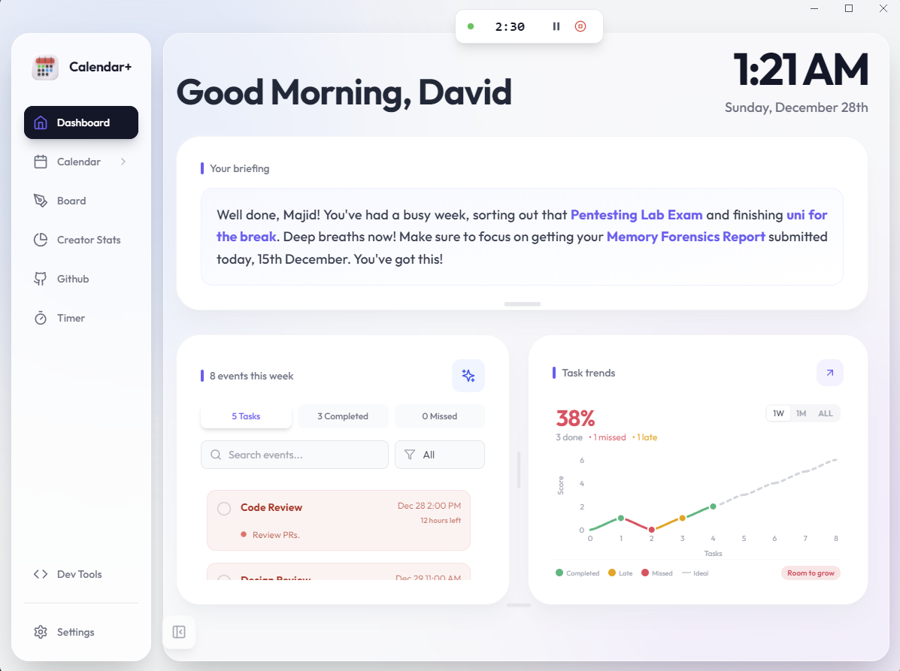
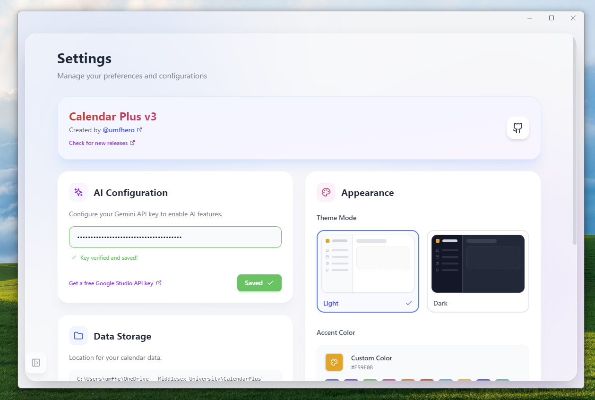
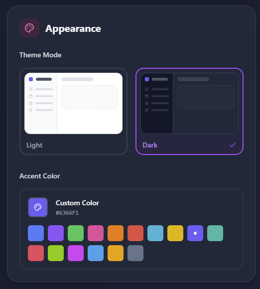
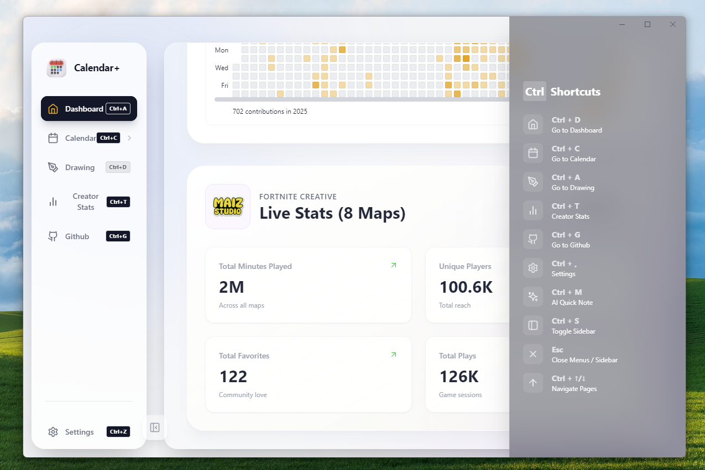
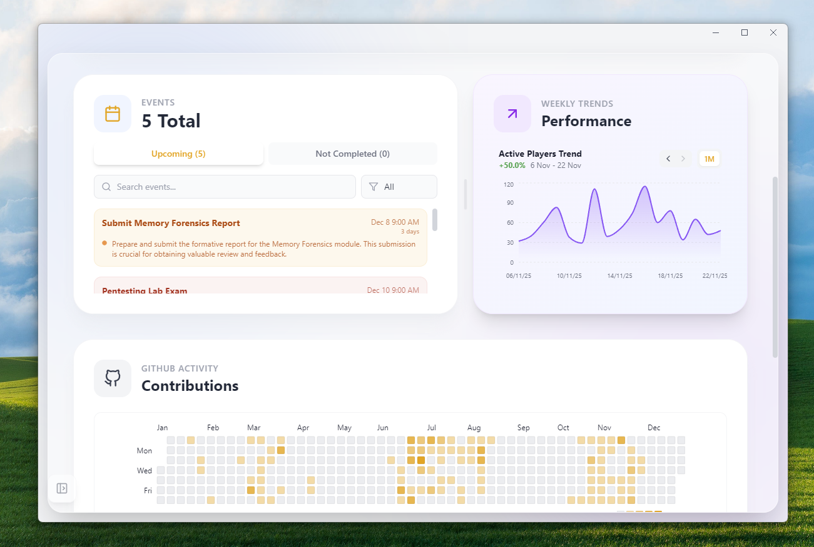

<h1>
  
  CalendarPlus
</h1>

---

**CalendarPlus** is a Windows desktop calendar application engineered for personal productivity, event management and calendar data visualization. This project is developed for private use, but the codebase is open for review and local experimentation by others.

> **Note:** This is a personal-use project, not intended for public deployment. Feedback and code exploration are welcome.

## Features

- Intuitive event CRUD (create, read, update, delete) operations
- Recurring events and smart reminders
- Responsive, modern UI built with React, TypeScript, and Tailwind CSS
- Local CSV import for analytics and custom graphing (Epic Games CSV support)
- Electron-based desktop experience for Windows, macOS, and Linux
- (Optional) Integration hooks for external calendar APIs (e.g., Google Calendar)
- Offline-first architecture with local persistence

## Screenshots

### Dashboard

  
  
<em>Central command center featuring widget-based layout and real-time data.</em>

### Application Tour

|   |   |
|:---:|:---:|
|  **Interactive Calendar** Robust event management built with React & TypeScript. |  **Creator Stats** Data visualization and analytics from imported CSVs. |
|  **Settings** Comprehensive app configuration and local storage management. |  **Appearance** Theming and UI customization powered by Tailwind CSS. |
|  **AI Quick Note** Smart input processing for rapid task creation. |  **Drawing Mode** Canvas-based sketching for visual note-taking. |
|  **Feature Toggles** Modular architecture allowing dynamic feature enabling. |  **Keyboard Shortcuts** Productivity boosters for power users. |
|  **Extended Dashboard** Scrollable view showcasing responsive grid layout. | |

---

## Tech Stack

- **Frontend:** React 18, TypeScript, Vite, Tailwind CSS
- **Desktop Runtime:** Electron
- **Data Handling:** Local storage, CSV parsing for analytics
- **Build Tooling:** Vite, PostCSS
- **Visualization:** Custom chart components

## Security & Privacy

- This project is for personal use. Do **not** commit sensitive data or API keys.
- If you fork or clone, create your own `.env` file for local configuration.

---
